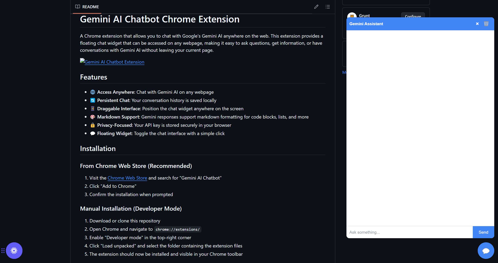

# Gemini AI Chatbot Chrome Extension

A Chrome extension that allows you to chat with Google's Gemini AI anywhere on the web. This extension provides a floating chat widget that can be accessed on any webpage, making it easy to ask questions, get information, or have conversations with Gemini AI without leaving your current page.



## Features

- 🌐 **Access Anywhere**: Chat with Gemini AI on any webpage
- 🔄 **Persistent Chat**: Your conversation history is saved locally
- 📱 **Draggable Interface**: Position the chat widget anywhere on the screen
- 🎨 **Markdown Support**: Gemini responses support markdown formatting for code blocks, lists, and more
- 🔒 **Privacy-Focused**: Your API key is stored securely in your browser
- 💬 **Floating Widget**: Toggle the chat interface with a simple click

## Installation

### From Chrome Web Store (Recommended)

1. Visit the [Chrome Web Store](https://chrome.google.com/webstore) and search for "Gemini AI Chatbot"
2. Click "Add to Chrome"
3. Confirm the installation when prompted

### Manual Installation (Developer Mode)

1. Download or clone this repository
2. Open Chrome and navigate to `chrome://extensions/`
3. Enable "Developer mode" in the top-right corner
4. Click "Load unpacked" and select the folder containing the extension files
5. The extension should now be installed and visible in your Chrome toolbar

## Setup

1. **Get a Gemini API Key**:

   - Visit [Google AI Studio](https://ai.google.dev/)
   - Sign in with your Google account
   - Navigate to "API Keys" in your account settings
   - Create a new API key (it should start with "AIza...")
   - Copy the API key

2. **Configure the Extension**:
   - Click on the Gemini AI Chatbot icon in your Chrome toolbar
   - Paste your API key in the field provided
   - Click "Save"
   - You're all set! The extension is now ready to use

## Usage

1. **Open the Chat Widget**:

   - Click the floating chat button (💬) that appears on any webpage
   - The chat widget will appear on the screen

2. **Chat with Gemini AI**:

   - Type your question or message in the input field
   - Press Enter or click the Send button
   - Gemini AI will process your message and respond

3. **Widget Controls**:
   - **Drag**: Click and drag the header to move the widget around
   - **Close**: Click the × button to hide the widget (the floating button remains)
   - **Clear**: Click the 🗑️ button to clear your conversation history

## Technical Details

The extension consists of several components:

- **Popup Interface**: For API key management
- **Content Script**: Injects the chat widget into webpages
- **Background Script**: Handles API communication with Gemini
- **Widget**: The draggable chat interface

The extension uses the Gemini 2.0 Flash model for fast, efficient responses.

## Privacy & Data

- Your API key is stored in Chrome's secure storage
- Chat history is stored locally in your browser
- No data is sent to any servers other than Google's Gemini API
- The extension only requires permissions necessary for its functionality

## Troubleshooting

- **Widget Not Appearing**: Refresh the page or check if the extension is enabled
- **API Key Issues**: Ensure your API key is valid and has been entered correctly
- **Rate Limiting**: If you encounter errors, you may have reached your API usage limit

## Development

### Project Structure

```
gemini-chatbot-extension/
├── background.js      # Handles API requests and storage
├── content.js         # Injects the widget into webpages
├── icon.png           # Extension icon
├── manifest.json      # Extension configuration
├── marked.min.js      # Markdown parser
├── popup.html         # API key input interface
├── popup.js           # Handles saving the API key
├── widget.css         # Compiled CSS for the chat widget
├── widget.js          # Chat widget implementation
└── widget.scss        # SCSS source for widget styling
```

### Building from Source

1. Clone the repository
2. Make your changes
3. If modifying SCSS files, compile them to CSS:
   ```
   sass widget.scss:widget.css
   ```
4. Load the extension in developer mode as described in the installation section

## License

This project is licensed under the MIT License - see the LICENSE file for details.

## Contributing

Contributions are welcome! Please feel free to submit a Pull Request.

1. Fork the repository
2. Create your feature branch (`git checkout -b feature/amazing-feature`)
3. Commit your changes (`git commit -m 'Add some amazing feature'`)
4. Push to the branch (`git push origin feature/amazing-feature`)
5. Open a Pull Request

## Acknowledgments

- Google's Gemini AI for powering the chat functionality
- [Marked.js](https://marked.js.org/) for Markdown rendering
